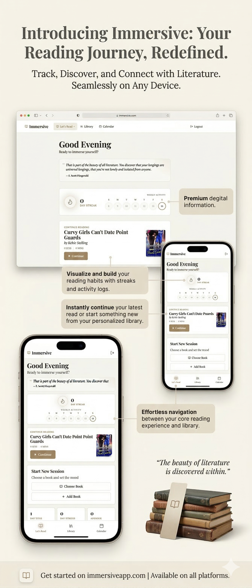

# 📖 Immersive: The Ultimate Reading Companion



**Vibe-coded** to create an unparalleled immersive reading experience. **Immersive** is a full-stack application designed for both fiction and non-fiction readers who crave distraction-free, mood-adaptive sessions. 

Transform your reading into a ritual with session tracking, integrated notes, AI-powered insights, and atmospheric soundscapes.

---

## ✨ Key Features

- **🛡️ Independent Auth**: Secure, independent Google OAuth authentication flow.
- **📚 Smart Discovery**: Integration with **Google Books API** for dynamic book discovery and automatic metadata fetching.
- **🤖 AI Book Companion**: An intelligent chatbot that provides contextual clarification, character recall, and concept explanations—all while respecting **spoiler prevention** guardrails.
- **🎧 Mood-Adaptive Audio**: Timed reading sessions paired with customizable background music and themes tailored to the genre or mood.
- **📊 Reading Analytics**: 
  - **Streak Tracking**: Maintain your momentum with a visual calendar heatmap.
  - **Library Management**: Organise books into *Want to Read*, *Currently Reading*, and *Completed*.
- **📝 Contextual Notes**: Markdown-supported notes linked directly to specific books and reading sessions.
- **� Observability**: Integrated with **Langfuse** for advanced tracing, latency monitoring, and performance observability of AI interactions.
- **� Paper-like Aesthetic**: A mobile-first, responsive UI designed with a premium, focused "paper" feel.

---

## 🧠 AI System Design

The heart of Immersive lies in its sophisticated AI orchestration:

- **Guardrails**: Custom logic to prevent spoilers and maintain the integrity of your reading experience.
- **Deep Grounding**: Leverages the **Google Books API** for highly structured, book-level context.
- **Fresh Grounding**: Uses **Google Search** to provide up-to-date supplemental information or real-world references related to your reading.
- **Tracing**: Full visibility into AI inputs and outputs via **Langfuse** to ensure high-quality responses.

---

## 🛠️ Tech Stack

| Component | Technology |
| :--- | :--- |
| **Frontend** | Next.js, TailwindCSS, Radix UI |
| **Backend** | Python (FastAPI/Flask), MongoDB |
| **AI/ML** | Gemini API, Langfuse (Observability) |
| **Infrastructure** | Vercel (Frontend), Render (Backend), Google OAuth 2.0 |

---

## 🚀 Quick Start

### 1. Prerequisites
- Node.js (v18+)
- Python (v3.10+)
- MongoDB Atlas account

### 2. Installation

**Backend:**
```bash
cd backend
python -m venv venv
source venv/bin/activate # Windows: venv\Scripts\activate
pip install -r requirements.txt
# Set MONGO_URL, GOOGLE_CLIENT_ID, and LANGFUSE keys in .env
python server.py
```

**Frontend:**
```bash
cd frontend
npm install
# Set NEXT_PUBLIC_BACKEND_URL in .env
npm run dev
```

---

## 🎨 Aesthetic Philosophy

Immersive isn't just an app; it's an environment. We utilize **glassmorphism**, **soft gradients**, and **minimalist interactions** to ensure that the interface never competes with the book. The "Paper-like" design reduces eye strain and promotes deep work.

---

<p align="center">
  <i>Bringing the magic back to every page.</i>
</p>
